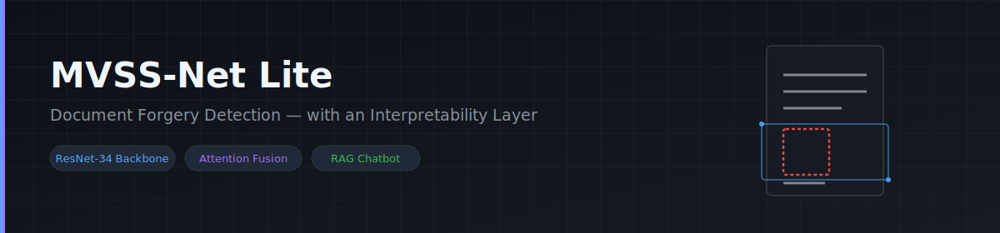
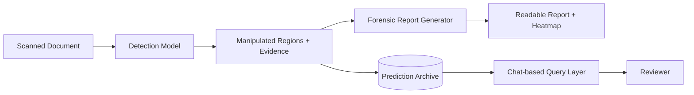

  

   

  
  
  
  

 

## Overview

Most forgery detectors give you a number: forged, or not, with some confidence score attached. They don't tell you why. **MVSS-Net Lite** is a document forgery detection system, built during a research internship at CDAC, that finds tampered regions at the pixel level and explains what it found instead of just handing over a score.

## What it does

- Detects manipulated regions in scanned documents (splicing, altered fields, tampered signatures) using a fusion-based deep learning model
- Explains each detection in plain language, backed by measurable evidence (edge inconsistencies, region confidence) instead of a single opaque score
- Lets reviewers ask questions about past results in natural language, instead of digging through logs
- Includes an evaluation harness that checks the model, the generated reports, and the retrieval system for accuracy over time

## How it works

A document goes in. The model scores it region by region for signs of tampering. What comes out is a report a non-technical reviewer can actually read, with every past result stored and searchable afterward.

## Under the hood

| Layer | Approach |
|---|---|
| Detection model | MVSS-Net architecture with a ResNet-34 backbone and attention-based feature fusion |
| Evidence scoring | Edge-consistency and per-region confidence, not just one output number |
| Report generation | Model outputs converted into natural-language forensic summaries |
| Query layer | Retrieval-augmented querying over an archive of past predictions |

## Why this approach

A probability score isn't enough when someone actually has to act on a forgery flag. In legal review, financial checks, or academic document verification, you need to know what specifically looked wrong. This project treats explainability as part of the core system, not something bolted on after the fact.

## Project status

Right now the team is focused on two things: getting the detection pipeline solid, and building the results database it will feed into. Report generation and the natural-language query layer come after that, since both depend on that database being in place first.

 

  Built at CDAC · 2026

