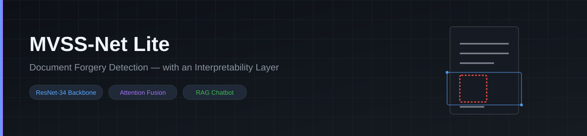
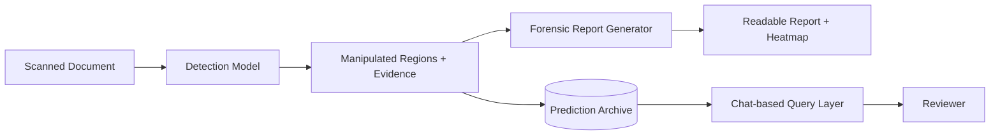

  

   

  
  
  
  

 

## Overview

Most forgery detectors give you a number: forged, or not, with some confidence score attached. They don't tell you why. **MVSS-Net Lite** is a document forgery detection system, built during a research internship at CDAC, that finds tampered regions at the pixel level and explains what it found instead of just handing over a score.

## What it does

- Detects manipulated regions in scanned documents (splicing, altered fields, tampered signatures) using a fusion-based deep learning model
- Explains each detection in plain language, backed by measurable evidence (edge inconsistencies, region confidence) instead of a single opaque score
- Lets reviewers ask questions about past results in natural language, instead of digging through logs
- Includes an evaluation harness that checks the model, the generated reports, and the retrieval system for accuracy over time

## How it works

```mermaid
flowchart LR
    A[Scanned Document] --> B[Detection Model]
    B --> C[Manipulated Regions + Evidence]
    C --> D[Forensic Report Generator]
    C --> E[(Prediction Archive)]
    D --> F[Readable Report + Heatmap]
    E --> G[Chat-based Query Layer]
    G --> H[Reviewer]
```

A document goes in. The model scores it region by region for signs of tampering. What comes out is a report a non-technical reviewer can actually read, with every past result stored and searchable afterward.

## Under the hood

| Layer | Approach |
|---|---|
| Detection model | MVSS-Net architecture with a ResNet-34 backbone and attention-based feature fusion |
| Evidence scoring | Edge-consistency and per-region confidence, not just one output number |
| Report generation | Model outputs converted into natural-language forensic summaries |
| Query layer | Retrieval-augmented querying over an archive of past predictions |

## Why this approach

A probability score isn't enough when someone actually has to act on a forgery flag. In legal review, financial checks, or academic document verification, you need to know what specifically looked wrong. This project treats explainability as part of the core system, not something bolted on after the fact.

## Project status

**Current State (July 2026):**
- **Model Training:** Stage 1 and Stage 2 training of MVSS-Net Lite are complete. Stage 2 successfully fine-tuned the model for document tampering with a high `pos_weight` to handle extreme class imbalance.
- **Inference Pipeline:** The FastAPI backend is fully operational. We recently resolved critical inference bugs related to image preprocessing (PIL interpolation matching) and threshold tuning (strict `0.97` segmentation threshold) to combat background inflation.
- **Evaluation & Review:** We have prepared a tightly masked, fully verified dataset of pure Document Forgeries (RTM) and Authentic Documents (MIDV500/RTM) that successfully pass end-to-end evaluation with 0 false positives for the latest mentor update.
- **Next Steps:** Scaling up the natural-language query layer and finalizing the database schema to store and retrieve historical forensic reports.

 

  Built at CDAC · 2026

