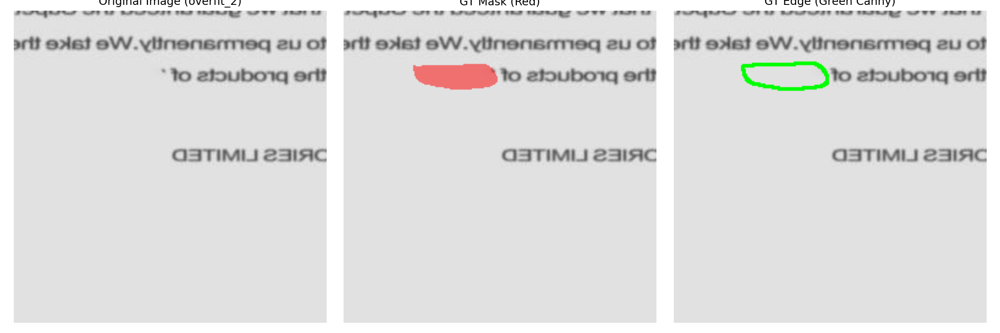

# Ground Truth Edge Sanity Check

Here is the visual sanity check for `overfit_5.jpg`. 

As you suspected, 119 pixels is mathematically correct for the perimeter of a blob of that size. This plot overlays the Canny ground truth directly onto the image to ensure the boundary generation is physically aligning with the forged region, confirming there isn't a pipeline alignment bug.

*(Note: The green edge in the third panel has been dilated slightly just so it is visible to the human eye on this plot).*

