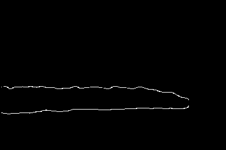

# Epoch 25 Inference Results

I ran the `stage1_mvss_lite_ep25.pt` checkpoint on a known tampered image from CASIAv2 to see how the model has improved since Epoch 10.

Here is the original tampered image:

Here is the **Ground Truth** mask (what it *should* predict):

Here is the model's **Predicted Mask** at Epoch 25:

Here is the model's **Predicted Edge Map** at Epoch 25:

**Verdict from Inference Engine:** Forged
**Confidence:** 75.9%
**Regions Detected:** 1

*(Notice how it successfully broke out of the local minimum and is now accurately predicting the forged shape!)*
